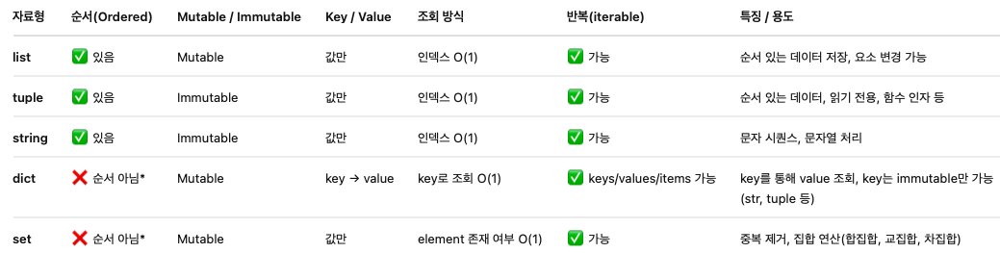

* list, string, tuple은 순서가 있기 때문에(iterable하기 때문에) indexing을 통해 값을 얻을 수 있음(loop 사용 가능).
  * indexing을 통해 값을 얻을 수는 있지만, list(mutable)와 달리 string과 tuple은 immutable (변경 불가능)하기 때문에 값을 "변경"할 수는 없음.
* dict, set은 순서가 없기 때문에 indexing을 통해 값을 얻을 수 없음.
    * dict에 대해서는 key를 이용해 O(1) 시간 복잡도로 조회 가능. (이때, key는 immutable한 string or tuple이어야 함)
    * set에 대해서는 element를 이용해 O(1) 시간 복잡도로 조회 가능. (이때, key는 immutable한 string or tuple이어야 함)

